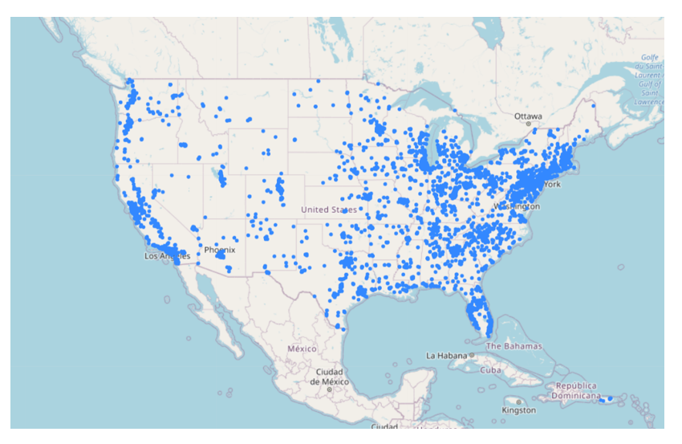
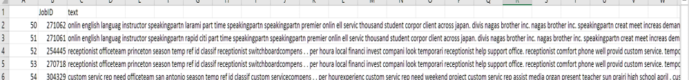
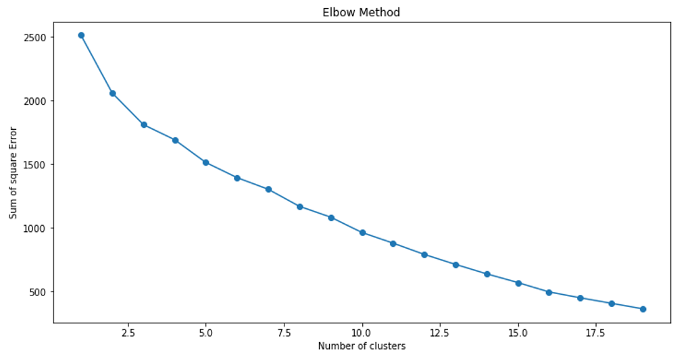
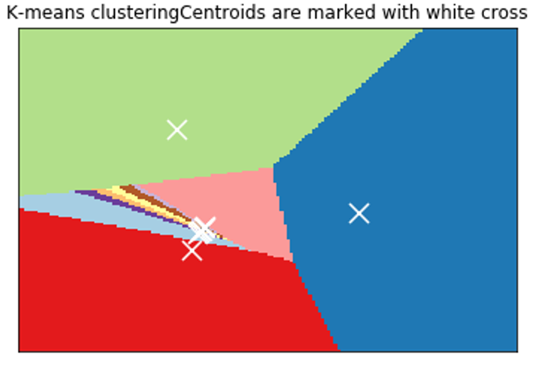

**Recommendation Engine**

**What is the Objective?**

The objective is to build a Recommendation Engine which takes Content
and Collaborative approaches into consideration for recommending job to
a user. It is used to analyze available data to make suggestions for
something that a website user might be interested in our cases it is
recommending jobs.

An [engine](http://whatis.techtarget.com/definition/engine), in a
software context, is a special-purpose program that performs a task
through a variable algorithm, often as a feature of some larger program.
A [search
engine](http://searchsoa.techtarget.com/definition/search-engine) is one
type of recommendation engine, responding to search queries with pages
of results that are (at least theoretically) the search engine\'s best
suggestions for websites that satisfy the user\'s query, based on the
search term plus other data, such as location and trending topics.

**Who uses?**

Basically any list of inventories big enough to make the customers
confused in a pool of choices can benefit from a recommender system. The
inventory subject to the recommendation can be digitally available
contents such as music, movies, TV programs, or news. They can also be
physical (or so-called brick and mortar) products such as grocery or
other consumer products, or even job positions or dating profiles.

-   **Spotify uses Collaborative filtering for radio featuring, related
    artists and recommending trendy songs.**

-   **Microsoft has implemented recommendation systems in a variety of
    products, from providing recommendations to customer when he/she
    watch's an Xbox movie, to recommending a workout based on his/her
    previous activity with Microsoft band**

-   **Netflix for movie recommendations**

-   **Quora for quest recommendations**

-   **eBay, Amazon for product**

-   **LinkedIn for job recommendations**

-   **Google News Personalization System**

-   **Facebook for "you may know", "you might like" etc.**

-   **Recommendation systems is widely being used in almost all online
    services**

**Data**

The data is of Quickhire company which has collected two years of data
from 2014 to 2015. It used to recommend jobs based on distance between
the applicant's location and job location and industry to make
recommendations to the applicants. However, their engine might not be
working efficiently because it is seen that almost 70% of the data
contains NA in their Industry and this boils down to the point that the
recommendations are mostly from the distance of applicant from the job
which is ok but in order to get more personalized recommendations it
won't work as the engine might be suggesting jobs which doesn't match
applicants domain and hence that would not make a good recommendations.

**The dataset consists of twelve csv files.**

-   **Combined\_Jobs\_final** : The dataset consists of different
    columns which are

-   **Job.ID** : Unique number given to every job and there are 84,067
    job openings

-   **Provider** : there are two providers so the provider of that job.
    This is not needed for analysis

-   **Status**: Is the job currently active? And all the jobs are active
    and we can drop this attribute

-   **Slug:** it is combination of title, position, company and city
    this can be dropped

-   **Title:** It is the combination of position and company and this is
    of no use

-   **Position**: It is the name of the position this info can be used
    for content recommendation has few NA

-   **Company:** It is the name of the company in which job is posted
    and is needed for analysis

-   **City:** This is the city where the job posting is done and is
    needed

-   **State.Name**: the state in which the city is located and is not
    needed as we already taken city

-   **State.Code**: this is of no use

-   **Address:** no need of address as city is taken into consideration

-   **Latitude:** This is already taken into account by present company
    recommendation

-   **Longitude:** This is already taken into account by present company
    recommendation

-   **Industry:** although this is needed but there are 70% NA hence
    ignoring the industry

-   **Job.Description:** This can be ignored but we can draw content
    from it so it is taken into consideration

-   **Requirements**: this is of no use

-   **Salary:** This is mostly NA hence dropping

-   **Employement.Type:** This is about part time and full time
    employment and is considered

-   **Education.Required**: This is also considered

Now even though few attributes are important it has been ignored cause
they might not be present in user data hence while searching this wont
help in any way. So while creating corpus users data should also be
taken into consideration and this will refine search. In real time the
data keeps on changing and updating hence a refresh rate would help in
tackling this.

Although there are important attributes in job corpus because of NA
values in almost all the attributes it is necessary to take a look at
them and understand how they happened and find optimum solution. There
are about 10 companies whose city is NA and have almost 500 records now
the NA have been replaced with the headquarters of the company. Next
there are NA values of company Uber in Employment.Type and this has been
replaced with Part-time/Full-time and this are the assumptions that have
been made for NA values.

The attributes used for creating job corpus are Position, Company, City,
Employment type and job description. Before creating corpus the
characters in the attribute are not only alphabets but also other ascii
characters. So pre-processing is done which includes converting all the
characters to lower case, removing all the characters except alphabets,
stemming the data and also removing the stop words. Now the data is
ready for creating job corpus. Tf-IDF matrix is used to create matrix
and dense function is used to shrink the matrix.

For User there are many files which are pretty important to filter and
gear up for better recommendation. The files are:

**Credentials**: This file consists of applicants skills and tools they
used and have hands on. As there is no information from the job corpus
it is irrelevant to consider.

**Education**: This is featured in job corpus so this would help in
content recommendation. Looking at the data there are few columns in
this file they are:

**Graduate.Year**: which year did the applicant finished final semester.
The only record that matter is the latest study of the applicant.

**School.Name**: which school did the applicant pursue. This attribute
will not help in recommending as job providers will not specifically
require applicants from particular school.

**City**: which city did he/she study. This city is covered in
applicants info hence this is not included.

**Degree:** what type of education did the applicant had. This is the
education applicant had and this is need as it might match the Education
requirement of the job.ID

With these two attributes from Education There are NA in both the
attributes so the best way to deal is to remove all the records that
contains NA in latest graduate year and then sort it by latest graduate
year and choose the latest one for each applicant and the Degree
contains text and is cleaned.

**Experience:** This criteria is important to recommend jobs accordingly
but the problem is each company has different role name for the same
work and due to this the recommendation can go off the relevance and
hence ignoring. The criteria can be brought in if the job seeker
specifies the experience requirement but as it is not present it is not
considered.

**Interest:** The Interest file mainly deals with the hobbies and the
usage of time by applicants when they are free. This doesn't make
recommendation any better. Hence, not considering

**Job\_Views:** There is another file named main\_jobviews which has
even more information like time spent on job, applied or not. This is
not considered.

**Languages**: The main language used in USA for communication is
English and there are very few companies which specifically ask for
skills in other languages and as this is not present in job corpus it is
ignored.

**Main\_Info:** This consists of Applicants City, Zipcode, State.Name,
State.Code, Latitude, Longitude, Estimated.age, Status, No.of Applied
jobs. In these the only relevant attribute I felt needed is City.

**MainJobViews:** This file contains Event.ID, Applicant.ID, Job.URL,
Position.Name, Company.Name, Spent.Time, Job.Applied. In these features
the job.applied has much to tell as it is the main focus of the
applicant. Hence I have extracted Job.ID which have been applied.

**Positions\_Of\_Interest:** The file contains the list of positions
that an applicant is interested in and this would be of interest as the
position name in job corpus might match with the position of interest.

**Visualizations:**

The map of United States revealing details about the number of jobs in
each area. This is derived using Folium package on latitude and
longitude information present in job dataset.

**Position Names**

The following wordcloud shows the different words used in position
attribute

 
**Job Cities:** Most Jobs are present in Chicago, Houston, SFO,
Indianapolis and so on.

 

**Collaborative Filtering Models**

Collaborative ?ltering models use the collaborative power of the ratings
provided by multiple users to make recommendations. The main challenge
in designing collaborative ?ltering methods is that the underlying
ratings matrices are sparse. Consider an example of a movie application
in which users specify ratings indicating their like or dislike of
speci?c movies. Most users would have viewed only a small fraction of
the large universe of available movies. As a result, most of the ratings
are unspeci?ed. The speci?ed ratings are also referred to as observed
ratings. The basic idea of collaborative ?ltering methods is that these
unspeci?ed ratings can be imputed because the observed ratings are often
highly correlated across various users and items. For example, consider
two users named Alice and Bob, who have very similar tastes. If the
ratings, which both have speci?ed, are very similar, then their
similarity can be identi?ed by the underlying algorithm. In such cases,
it is very likely that the ratings in which only one of them has
speci?ed a value, are also likely to be similar. This similarity can be
used to make inferences about incompletely speci?ed values.

The dataset consists of 7812 five level rating of different applicants
on different jobs. Going down further it is seen that the matrix is only
filled with 0.04% of ratings and the remaining are zeros. For the sake
of reducing the dimensions I have considered only those applicants or
records who gave ratings to more than one job. It is also found that no
applicant rated more than 45 jobs. Applied SVD and took the U matrix
which is user\*user matrix. Now for a user to find out the most similar
users the svd of the user is compared with matrix by cosine similarity
distance and took the most similar user index. In order to recommend
jobs we need to find to which jobs did the similar user rate and then
recommend those jobs to the user.

The file train\_data consists of all the ratings given by applicants to
jobids. On creating a matrix with rows as applicants and columns as
jobid and ratings as the value. It is found that the matrix is 4% filled
this says that it is extremely sparse matrix. Inorder to reduce its
dimensions I have taken only the users who gave rating to more than one
job.ID and thus the records reduced from 3027 to 1533 and reducing tis
sparsity. Above this I have applied SVD and have considered U matrix
which is user\*user matrix. Inorder to recommend a user with jobs we
need to find out the similar kind of user and then recommend jobs that
the applicant has rated. So the SVD gave the relation of a user with all
other users and with cosine similarity I found the 25 users who are more
similar to a user and have recommended the jobs that they have applied
to.

**1.3.2 Content-Based Recommender Systems**

In content-based recommender systems, the descriptive attributes of
items are used to make recommendations. The term "content" refers to
these descriptions. In content-based methods, the ratings and buying
behavior of users are combined with the content information available in
the items. For example, consider a situation where John has rated the
movie Terminator highly, but we do not have access to the ratings of
other users. Therefore, collaborative ?ltering methods are ruled out.
However, the item description of Terminator contains similar genre
keywords as other science ?ction movies, such as Alien and Predator. In
such cases, these movies can be recommended to John. In content-based
methods, the item descriptions, which are labeled with ratings, are used
as training data to create a user-speci?c classi?cation or regression
modeling problem. For each user, the training documents correspond to
the descriptions of the items she has bought or rated. The class (or
dependent) variable corresponds to the speci?ed ratings or buying
behavior. These training documents are used to create a classi?cation or
regression model, which is speci?c to the user at hand (or active user).
This user-speci?c model is used to predict whether the corresponding
individual will like an item for which her rating or buying behavior is
unknown.

Content-based methods have some advantages in making recommendations for
new items, when su?cient rating data are not available for that item.
This is because other items with similar attributes might have been
rated by the active user. Therefore, the supervised model will be able
to leverage these ratings in conjunction with the item attributes to
make recommendations even when there is no history of ratings for that
item. Content-based methods do have several disadvantages as well:

1\. In many cases, content-based methods provide obvious recommendations
because of the use of keywords or content. For example, if a user has
never consumed an item with a particular set of keywords, such an item
has no chance of being recommended. This is because the constructed
model is speci?c to the user at hand, and the community knowledge from
similar users is not leveraged. This phenomenon tends to reduce the
diversity of the recommended items, which is undesirable.

2\. Even though content-based methods are e?ective at providing
recommendations for new items, they are not e?ective at providing
recommendations for new users. This is because the training model for
the target user needs to use the history of her ratings. In fact, it is
usually important to have a large number of ratings available for the
target user in order to make robust predictions without over?tting.

Therefore, content-based methods have di?erent trade-o?s from
collaborative ?ltering systems. For example, users can specify relevant
keywords in their own pro?les. These pro?les can be matched with item
descriptions in order to make recommendations. Such an approach does not
use ratings in the recommendation process, and it is therefore useful in
cold-start scenarios. In this way the cold start problem can be solved
and more personalized recommendations can be generated.

To apply content based recommendation a job corpus is created with
position name, company name, city name, education required and
description for each job and then a user query is done with his
interests, applied job, education and city. The TF-IDF matrix is applied
to job corpus and also to user query and then cosine similarity is
chosen for user and corpus which has yielded the most similar jobs for
the user and then the job ids are recommended to the user.

Now with all these files I have created a user dataframe which contains
education, city, job views, position of interest and created a TF-IDF
vector with the training set and this is compared to the job corpus with
cosine similarity. Taking the top 25 job.ids which have highest cosine
similarity to the query and printing out has given the following result.

This shows the sample user query and the result

This is content-based recommendation...

**Clustering Analysis:** This is the fun part. Recommending on ratings
and content is pretty decent job and to add icing on the cake we have
considered clustering. The concept is that when we cluster, similar
users are going to come in same group and now finding the nearest users
to a user and recommending jobs that the nearest users have applied.

The process consists of clubbing the data of applicants from different
files i.e the applicants position of interest, their education
background, state and jobviews. As these all are categorical in nature
inorder to create clusters we have to convert them into numeric. The
columns are converted to dummies and elbow method is applied to find the
optimum number of cluster where the distance of each point of cluster is
going to be minimal from the centroid of that cluster. Applied k-means
with 10 clusters and did visualization with PCA. Now for an applicant
Euclidean distance is calculated with the members of the cluster and
have picked 25 applicants which have least distance. Now the jobs that
are viewed, applied by the other 25 applicants are recommended.

The curve with elbow method.

Visualization of clusters with centroids

 

With this the recommendation system can be improved by adding all the
recommendations done by three algorithms and making it a hybrid
recommendation system.

The Engine can be further developed by clustering Job data and can be
used to recommend nearest jobs to a job.

**Recommender Systems has few major hurdles**

**A. Sparsity Problem**

Sparsity problem is one of the major problems encountered by recommender
system and data sparsity has great influence on the quality of
recommendation. Generally, data of system like MovieLens is represented
in form of user-item matrix populated by ratings given to movies and as
no. of users and items increases the matrix dimensions and sparsity
evolves. The main reason behind data sparsity is that most users do not
rate most of the items and the available ratings are usually sparse.
Collaborative filtering suffers from this problem because it is
dependent over the rating matrix in most cases.

**B. Cold Start problem**

Cold start problem refers to the situation when a new user or item just
enters the system. Three kinds of cold start problems are: new user
problem, new item problem and new system problem. In such cases, it is
really very difficult to provide recommendation as in case of new user,
there is very less information about user that is available and also for
a new item, no ratings are usually available and thus collaborative
filtering cannot make useful recommendations in case of new item as well
as new user. However, content based methods can provide recommendation
in case of new item as they do not depends on any previous rating
information of other users to recommend the item.

**C. Scalability**

Scalability is the property of system indicates its ability to handle
growing amount of information in a graceful manner. With enormous growth
in information over internet, it is obvious that the recommender systems
are having an explosion of data and thus it is a great challenge to
handle with continuously growing demand. Some of the recommender system
algorithms deal with the computations which increase with growing number
of users and items. In CF computations grow exponentially and get
expensive, sometimes leading to inaccurate results. Methods proposed for
handling this scalability problem and speeding up recommendation
formulation are based on approximation mechanisms. Even if they improve
performance, most of the time they result in accuracy reduction.

**D. Serendipity**

Serendipity denotes the property of making fortunate discoveries while
looking for something unrelated, or the occurrence of such a discovery
during such a search.

The experience of browsing items in a physical space or online catalogue
can differ substantially. For example when you're browsing records in a
store you often come across items you weren't actively looking for but
which you instantly recognize as desirable. Online stores offer some
mechanisms for discovery but they're highly limited in scope when
compared to physical environments. They may offer a much higher number
of items on sale than a physical store, but because screen space is
scarce catalogues have to resort to categorization trees, so users are
only exposed to a small subset of the full range of possibilities.
Online, users have less peripheral vision and a limited awareness.

To overcome the issues of cold-start , Sparsity problem I have chosen
Collaborative filtering and Content Filtering and combined to make
hybrid filtering and when it comes to serendipity it is often difficult
to accomplish. So the recommendation system I worked mainly deals with
cold start and sparsity problem.

The basic models for recommender systems work with two kinds of data,
which are (i) the user-item interactions, such as ratings or buying
behavior, and (ii) the attribute information about the users and items
such as textual pro?les or relevant keywords. Methods that use the
former are referred to as collaborative ?ltering methods, whereas
methods that use the latter are referred to as content-based recommender
methods. I have combined these di?erent aspects to create hybrid
systems. Hybrid systems can combine the strengths of various types of
recommender systems to create techniques that can perform more robustly
in a wide variety of settings. In the following, I will discuss these
basic models brie?y.

